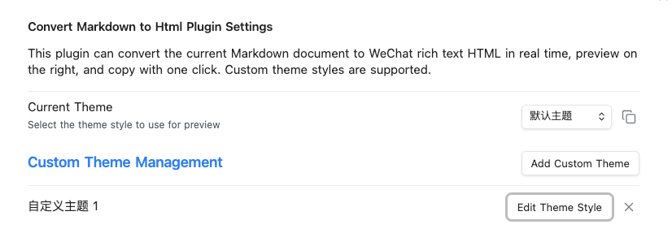
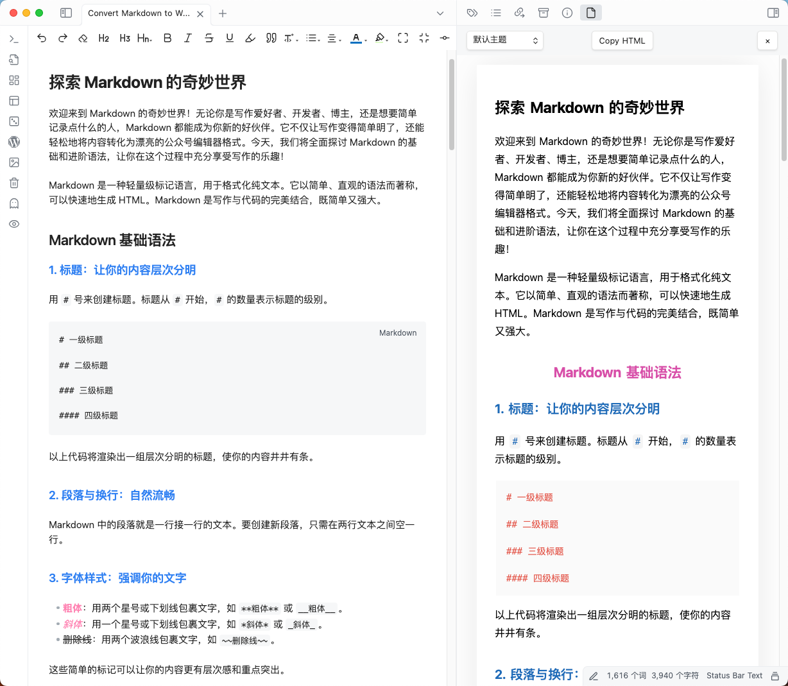

# Convert Markdown to HTML (Obsidian Plugin)

<p align="center">
<a href="README.md">English</a> | <a href="README_CN.md">中文</a>
</p>

A powerful Obsidian plugin that converts your current Markdown document into WeChat rich text HTML in real time. Instantly preview the result in a side pane and copy the HTML with one click. Supports custom theme styles for flexible and beautiful output.

## Features
- Real-time conversion of Markdown to WeChat-compatible rich text HTML
- Live preview in a dedicated side pane
- One-click copy of the generated HTML
- Custom theme management: add, edit, and delete your own styles
- Easy theme switching for different preview effects

## Screenshots

**Plugin Settings Page**  


**Live Preview**  


## Plugin Settings
- **Current Theme**: Select the theme style used for preview and HTML output.
- **Custom Theme Management**: Add, edit, or delete your own CSS themes for personalized output.
- **Copy Theme CSS**: One-click copy of the current theme's CSS for reuse or sharing.

## Installation

1. **Install dependencies**
   ```sh
   npm install
   ```
2. **Build the plugin**
   ```sh
   npm run build
   ```
3. **Copy to Obsidian Plugins Folder**
   - Copy the entire `dist/convert-markdown-to-html` folder to your Obsidian vault's `.obsidian/plugins/` directory.
4. **Enable the Plugin**
   - Open Obsidian, go to `Settings` > `Community plugins`, find `Convert Markdown to HTML`, and enable it.

### Manual Installation

If you prefer to install the plugin manually:

1. **Download the latest release**
   - Go to [GitHub Releases](https://github.com/imhaiqiao/convert-markdown-to-html/releases)
   - Download the latest release zip file

2. **Extract and copy to Obsidian plugins folder**
   - Extract the downloaded zip file
   - Copy the entire `convert-markdown-to-html` folder to your Obsidian vault's `.obsidian/plugins/` directory

3. **Enable the plugin in Obsidian**
   - Open Obsidian, go to `Settings` > `Community plugins`, find `Convert Markdown to HTML`, and enable it
