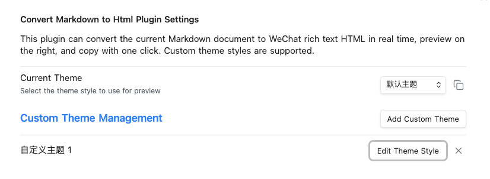
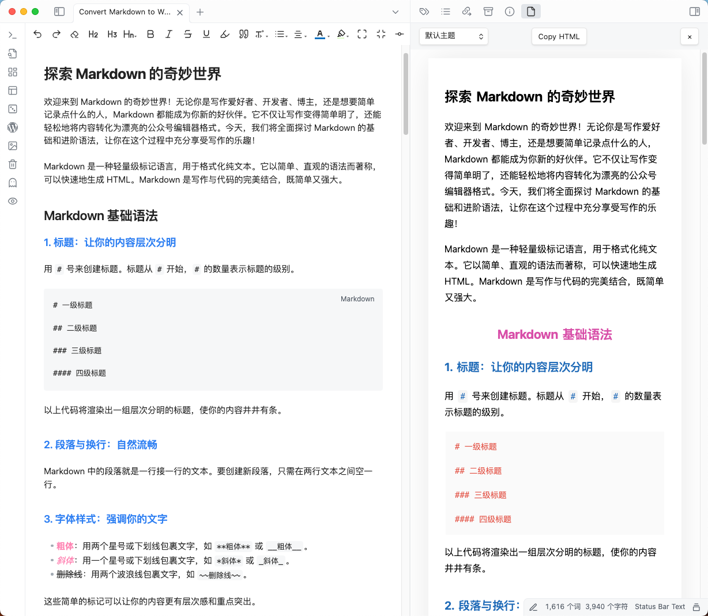

# Convert Markdown to HTML (Obsidian 插件)

<p align="center">
<a href="README.md">English</a> | <a href="README_CN.md">中文</a>
</p>

一个强大的 Obsidian 插件，能够将你当前的 Markdown 文档实时转换为微信公众号富文本 HTML。在侧边栏中即时预览结果，并一键复制 HTML。支持自定义主题样式，实现灵活美观的输出效果。

## 功能特性
- 实时将 Markdown 转换为微信公众号兼容的富文本 HTML
- 在专用侧边栏中实时预览
- 一键复制生成的 HTML
- 自定义主题管理：添加、编辑和删除你自己的样式
- 轻松切换主题，获得不同的预览效果

## 插件设置
- **当前主题**：选择用于预览和 HTML 输出的主题样式。
- **自定义主题管理**：添加、编辑或删除你自己的 CSS 主题，实现个性化输出。
- **复制主题 CSS**：一键复制当前主题的 CSS，便于重用或分享。

## 安装方法

1. **安装依赖**
   ```sh
   npm install
   ```
2. **构建插件**
   ```sh
   npm run build
   ```
3. **复制到 Obsidian 插件文件夹**
   - 将整个 `dist/convert-markdown-to-html` 文件夹复制到你的 Obsidian 库的 `.obsidian/plugins/` 目录。
4. **启用插件**
   - 打开 Obsidian，进入 `设置` > `社区插件`，找到 `Convert Markdown to HTML`，并启用它。

## 功能截图

**插件设置页面**  


**实时预览**  


### 手动安装

如果你更喜欢手动安装插件：

1. **下载最新版本**
   - 前往 [GitHub Releases](https://github.com/imhaiqiao/obsidian-convert-markdown-to-html-plugin/releases)
   - 下载最新版本的 zip 文件

2. **解压并复制到 Obsidian 插件文件夹**
   - 解压下载的 zip 文件
   - 将整个 `convert-markdown-to-html` 文件夹复制到你的 Obsidian 库的 `.obsidian/plugins/` 目录

3. **在 Obsidian 中启用插件**
   - 打开 Obsidian，进入 `设置` > `社区插件`，找到 `Convert Markdown to HTML`，并启用它